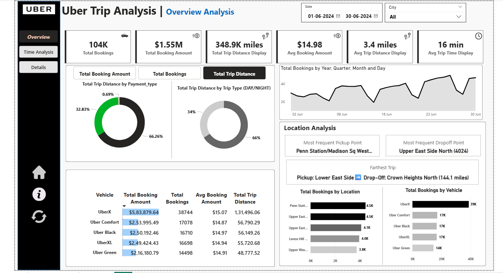
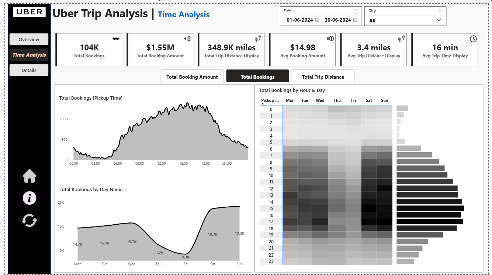
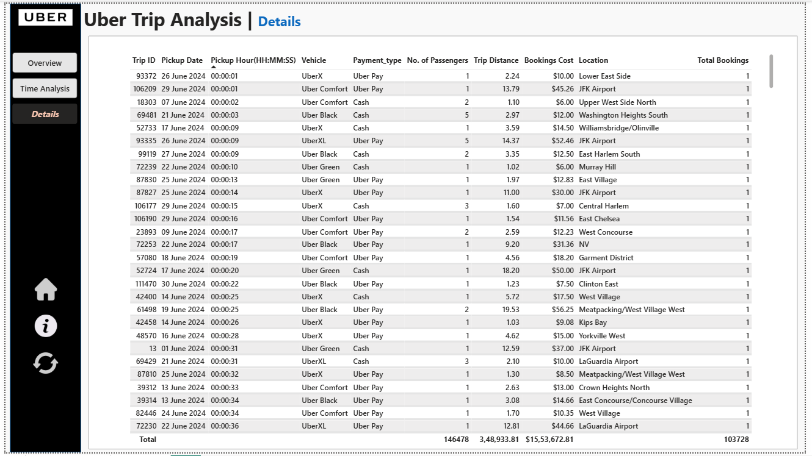

# 🚗 Uber Trip Analysis Dashboard


## 📊 Project Overview

An interactive Power BI dashboard analyzing **104,000+ Uber trips** across multiple cities, providing actionable insights into booking trends, revenue patterns, and operational efficiency. This end-to-end business intelligence solution empowers stakeholders with data-driven decision-making capabilities.

### 🎯 Business Impact
- **$1.55M** total revenue analyzed
- **348.9K miles** trip distance covered
- **16 min** average trip duration
- Multi-dimensional analysis across time, location, and vehicle types

---

## 🖼️ Dashboard Previews

### Overview Analysis

*Key metrics, payment analysis, trip patterns, and location insights*

### Time Analysis

*Temporal patterns with 10-minute intervals, weekly trends, and heatmaps*

### Details View

*Granular trip-level data with drill-through functionality*

---

## 🎯 Key Features

### 📈 Dynamic KPI Tracking
- **Total Bookings**: 104K trips analyzed
- **Total Revenue**: $1.55M generated
- **Average Booking Value**: $14.98 per trip
- **Trip Efficiency**: 3.4 miles average distance, 16 min average duration

### 🔄 Interactive Analysis
- **Dynamic Measure Selector**: Switch between Total Bookings, Revenue, and Trip Distance
- **Multi-dimensional Slicers**: Filter by Date, City, Vehicle Type, Payment Method
- **Drill-Through Capability**: Navigate from summary to granular details
- **Conditional Formatting**: Visual highlights for high/low performance

### 📊 Three Comprehensive Dashboards

#### 1️⃣ Overview Analysis
- Payment type distribution (Cash, Card, Uber Pay, Wallet)
- Day vs Night trip patterns (66% Day, 34% Night)
- Vehicle type performance matrix
- Daily booking trends
- Location intelligence (Top 5 locations, pickup/drop-off hotspots)
- Farthest trip tracking (144.1 miles analyzed)

#### 2️⃣ Time Analysis
- 10-minute interval breakdown throughout the day
- Weekly pattern analysis (Monday-Sunday)
- Hour & Day heatmap matrix (24hr × 7days)
- Peak demand identification (weekends show 19.2K bookings)

#### 3️⃣ Details Tab
- Complete trip-level data grid
- Drill-through from any visual
- Export-ready format
- Bookmarkable filtered views

---

## 🔍 Key Insights Discovered

### 📍 Location Intelligence
- **Penn Station/Madison Sq West** is the most frequent pickup point
- **Upper East Side** dominates drop-off locations (4024 trips)
- **Longest trip**: 144.1 miles (Lower East Side → Crown Heights North)
- **Top 5 locations** account for majority of bookings

### 💰 Revenue Patterns
- **UberX** generates highest revenue: $5.8M (38K bookings)
- **Uber Comfort** follows with $2.5M (17K bookings)
- **Average fare**: $14.98 with consistent pricing across vehicle types

### ⏰ Temporal Trends
- **Peak hours**: 12 PM - 6 PM (afternoon rush)
- **Weekend surge**: Saturday & Sunday show 19.2K bookings
- **Weekday dip**: Thursday lowest at 11.2K bookings
- **66% trips occur during daytime** (6 AM - 6 PM)

### 🚙 Vehicle Preferences
- **UberX most popular**: 38K total bookings
- **Location-specific**: Penn Station prefers UberX (4.5K bookings)
- **Premium demand**: Uber Black and Comfort maintain steady 17K bookings each

---

## 💼 Business Recommendations

1. **Dynamic Pricing**: Implement surge pricing during 12 PM - 6 PM peak hours
2. **Driver Allocation**: Increase availability at Penn Station and Upper East Side
3. **Weekend Strategy**: Deploy more drivers on Saturdays & Sundays
4. **Vehicle Distribution**: Prioritize UberX fleet in high-demand locations
5. **Payment Optimization**: Promote Uber Pay (66% usage) for faster transactions

---

## 🛠️ Technologies Used

| Technology | Purpose |
|------------|---------|
| **Power BI Desktop** | Data visualization and dashboard creation |
| **DAX (Data Analysis Expressions)** | Advanced calculations and measures |
| **Power Query M** | Data transformation and cleaning |
| **Excel/CSV** | Data source management |

---

## 🎓 Skills Demonstrated

✅ **Data Modeling**: Star schema, active/inactive relationships  
✅ **DAX Expertise**: Time intelligence, context transition, measure optimization  
✅ **UX Design**: Intuitive navigation, conditional formatting, bookmarks  
✅ **Business Intelligence**: KPI development, trend analysis, actionable insights  
✅ **ETL Process**: Power Query transformations, data quality checks  
✅ **Storytelling**: Clear visual hierarchy, insight-driven narratives  

---

## 📁 Repository Structure

```
uber-trip-analysis/
│
├── data/
│   ├── sample_uber_data.csv
│   ├── location_table.csv
│   └── data_dictionary.md
│
├── screenshots/
│   ├── overview_dashboard.png
│   ├── time_analysis.png
│   └── details_dashboard.png
│
├── powerbi/
│   ├── Uber_Trip_Analysis.pbix
│   └── dax_measures.txt
│
├── docs/
│   ├── business_requirements.md
│   └── technical_documentation.md
│
└── README.md
```

---

## 🚀 Getting Started

### Prerequisites
- Power BI Desktop (Latest version)
- Basic understanding of DAX and Power Query

### Installation
1. Clone the repository
```bash
git clone https://github.com/yourusername/uber-trip-analysis.git
```

2. Open the Power BI file
```
Navigate to powerbi/ folder
Open Uber_Trip_Analysis.pbix
```

3. Refresh data connections
- Update file paths in Power Query if needed
- Refresh all data sources

### Usage
1. Use **Date** and **City** slicers to filter data
2. Click **measure selector buttons** to switch metrics
3. **Right-click** any visual → "Drill through" → Details for granular view
4. Use **Clear Filters** button to reset all selections

---

## 📝 Future Enhancements

- [ ] Integrate real-time data refresh using Power BI Service
- [ ] Add predictive analytics for demand forecasting
- [ ] Implement Python visuals for advanced statistical analysis
- [ ] Create mobile-optimized dashboard layout
- [ ] Add customer sentiment analysis from ratings

---

## 👤 Author

**Your Name**  
📧 Email: your.email@example.com  
💼 LinkedIn: [linkedin.com/in/yourprofile](https://linkedin.com/in/yourprofile)  
🌐 Portfolio: [yourportfolio.com](https://yourportfolio.com)

---

## 📄 License

This project is licensed under the MIT License - see the [LICENSE](LICENSE) file for details.

---

## 🙏 Acknowledgments

- Dataset inspired by real-world Uber trip patterns
- Dashboard design following Power BI best practices
- Business requirements aligned with industry standards

---

**⭐ If you find this project helpful, please consider giving it a star!**

---

*Last Updated: November 2025*
